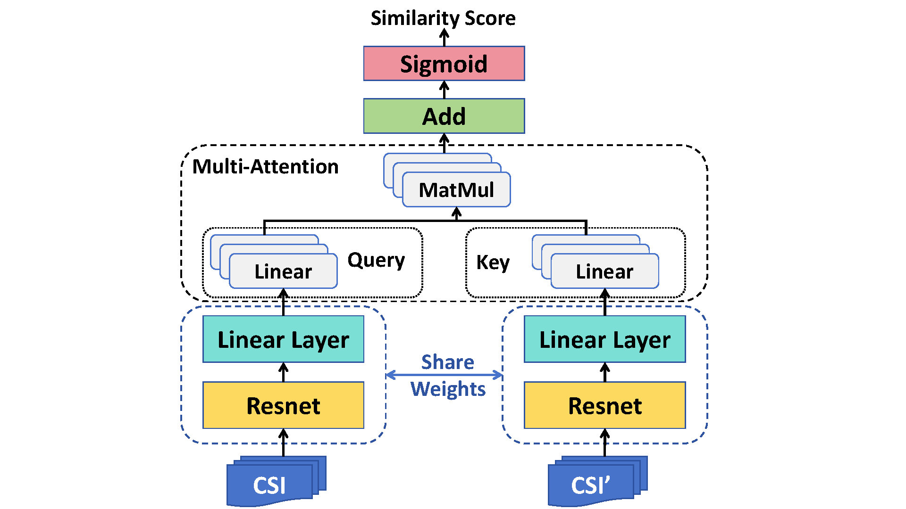
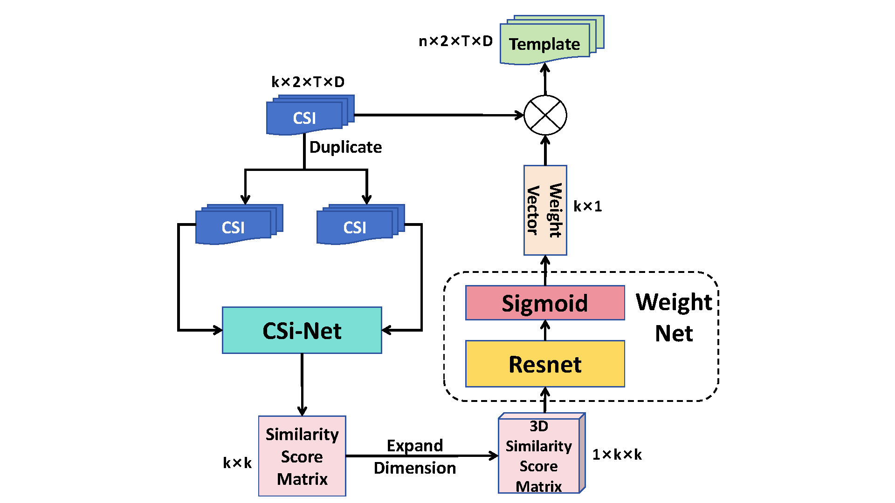

# CSi-Net

**Article:** CSi-Net: A Siamese Network for Cross-Domain Wi-Fi Sensing (under way)




## 1. Data

### 1.1 Dataset

to be published


### 1.2 Data Pre-process

Each sample has a dimension of 2*t*s, representing the channel, height, and width, respectively.

The 2 channels consist of the amplitude and cosine of phase. `t` is the sample number, and `s` is the subcarrier number.


## 2. How to Run

Here, we provide the common parameters for running the code. You can use the `--help` option to obtain a full list of parameters, such as "head num of multi-attention".


### 2.1 Full-shot

```shell
python full_shot.py --MMD --task <task name> --class_num <class number> --data_path <data path>
```

If you do not want to use MK-MMD during training, you can omit this parameter. The same applies to the following sections.



### 2.2 One-shot

#### 2.2.1 Cross Domain

```shell
python one_shot.py --MMD --task <task name> --class_num <class number> --data_path <data path> --test_list <the one-shot class>
```


#### 2.2.2 Cross Class

```shell
python cross_class-one_shot.py --MMD --task <task name> --class_num <class number> --data_path <data path> --test_list <the one-shot class>
```


### 2.3 Zero-shot

```shell
python zero_shot.py --MMD --task <task name> --class_num <class number> --data_path <data path> --test_list <the zero-shot class>
```


