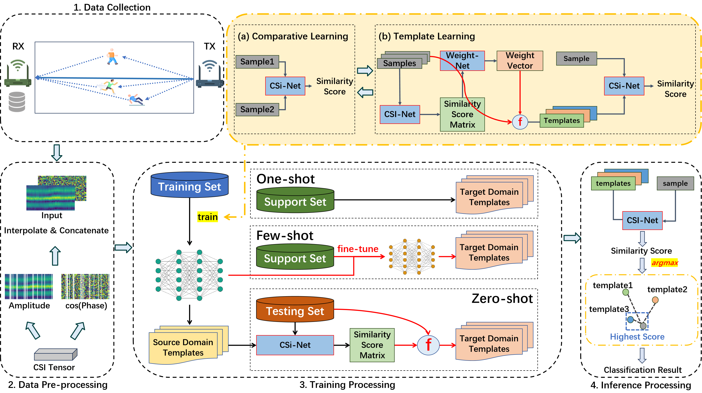

# CrossFi

**Article:** Zijian Zhao, Tingwei Chen, Zhijie Cai, Xiaoyang Li, Hang Li, Qimei Chen, Guangxu Zhu*, "[CrossFi: A Cross Domain Wi-Fi Sensing Framework Based on Siamese Network](https://ieeexplore.ieee.org/document/10891488)" (IEEE Internet of Things Journal (IOT))




## 1. Data

### 1.1 Dataset

Dynamic Part of [WiGesture Dataset](https://paperswithcode.com/dataset/wigesture)

### 1.2 Data Process

Each sample has a dimension of 2\*t\*s, representing the channel, height, and width, respectively.

The 2 channels consist of the amplitude and cosine of phase. `t` is the sample number, and `s` is the subcarrier number.

You can process the data refer to [RS2002/CSI-BERT: Official Repository for The Paper, Finding the Missing Data: A BERT-inspired Approach Against Package Loss in Wireless Sensing (github.com)](https://github.com/RS2002/CSI-BERT).


## 2. How to Run

Here, we provide the common parameters for running the code. You can use the `--help` option to obtain a full list of parameters, such as "head num of multi-attention".


### 2.1 Full-shot

```shell
python full_shot.py --MMD --task <task name> --class_num <class number> --data_path <data path>
```

If you do not want to use MK-MMD during training, you can omit this parameter. The same applies to the following sections.


### 2.2 One-shot

You can also use the code in few-shot and point the shot number as 1.

#### 2.2.1 Cross Domain

```shell
python one_shot.py --MMD --task <task name> --class_num <class number> --data_path <data path> --test_list <the one-shot class> --score distance
```


#### 2.2.2 Cross Class

```shell
python cross_class-one_shot.py --task <task name> --class_num <class number> --data_path <data path> --test_list <the one-shot class>
```


### 2.3 Zero-shot

```shell
python zero_shot.py --task <task name> --class_num <class number> --data_path <data path> --test_list <the zero-shot class>
```


### 2.4 Few-shot

#### 2.4.1 Cross Domain

**Pre-train**

```shell
python full_shot.py --MMD --task <task name> --class_num <class number> --data_path <data path> --not_full_shot --test_list <the zero-shot class>
```


**Fine-tuine**

```shell
python few_shot.py --MMD --task <task name> --class_num <class number> --data_path <data path> --test_list <the zero-shot class> --model_path <pre-train model path> --shot_num <k-shot> --score distance
```


#### 2.4.2 Cross Class

**Pre-train**

```shell
python full_shot.py --MMD --task <task name> --class_num <class number> --data_path <data path> --novel_class --test_list <the zero-shot class>
```


**Fine-tuine**

```shell
python  cross_class-few_shot.py --task <task name> --class_num <class number> --data_path <data path> --test_list <the zero-shot class> --model_path <pre-train model path> --shot_num <k-shot>
```


## 3. Citation

```
@ARTICLE{10891488,
  author={Zhao, Zijian and Chen, Tingwei and Cai, Zhijie and Li, Xiaoyang and Li, Hang and Chen, Qimei and Zhu, Guangxu},
  journal={IEEE Internet of Things Journal}, 
  title={CrossFi: A Cross Domain Wi-Fi Sensing Framework Based on Siamese Network}, 
  year={2025},
  volume={},
  number={},
  pages={1-1},
  keywords={Siamese Network;Cross-domain Learning;Few-shot Learning;Zero-shot Learning;Wi-Fi Sensing;Channel Statement Information},
  doi={10.1109/JIOT.2025.3542850}}

```

